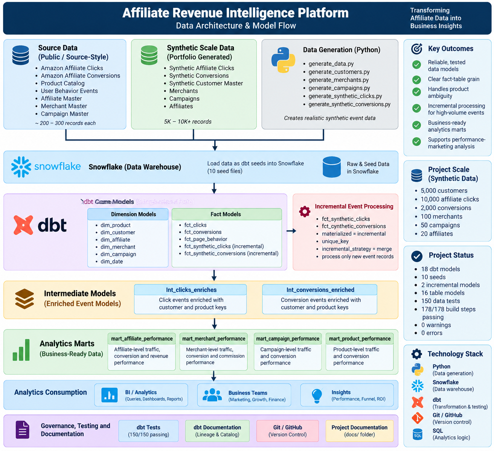

# Affiliate Revenue Intelligence Platform

A production-style **Analytics Engineering** project for transforming affiliate
click, conversion, product, customer, merchant, affiliate, and campaign data
into tested, documented, business-ready analytics models using **Snowflake,
dbt, SQL, Python, and Git**.

---

## Project Overview

Affiliate platforms generate large volumes of event-level data across clicks,
sessions, customers, merchants, campaigns, products, and conversions.

Raw event data is useful for ingestion, but difficult for analysts and business
teams to query directly.

This project builds a reliable analytics layer that transforms source-style and
synthetic affiliate data into reusable business models for performance
analysis.

The platform focuses on:

- Traffic and click performance
- Conversion performance
- Revenue and commission
- Affiliate performance
- Merchant performance
- Campaign performance
- Product performance
- Customer activity
- Funnel analysis

---

## Business Problem

Affiliate marketing platforms need to understand which affiliates, merchants,
campaigns, products, and traffic sources are driving profitable conversions.

Raw event data often contains:

- Different grains across datasets
- Missing attribution
- Repeated business entities
- High-volume event tables
- Multiple identifiers for the same business entity
- Potential aggregation fanout when facts are joined incorrectly

The goal of this project is to build a governed analytics layer that makes
these datasets reliable and easier to consume.

---

## Business Questions

The analytics layer is designed to answer questions such as:

- Which affiliates generate the most traffic, conversions, and revenue?
- Which merchants generate the strongest commission performance?
- Which campaigns generate high traffic but weak conversion?
- Which products receive significant traffic but convert poorly?
- How does affiliate performance change over time?
- Which traffic sources perform best?
- How do device type and country affect performance?
- What does the overall affiliate conversion funnel look like?
- Which products and customers contribute most to conversion activity?

---

## Architecture

```text
                         SOURCE DATA
                             │
             ┌───────────────┴───────────────┐
             │                               │
      Source-style data              Synthetic scale data
             │                               │
             └───────────────┬───────────────┘
                             │
                             ▼
                        dbt Seeds
                             │
                             ▼
                       Core Models
                    ┌────────┴────────┐
                    │                 │
                Dimensions          Facts
                    │                 │
                    └────────┬────────┘
                             │
                             ▼
                    Intermediate Models
                             │
                             ▼
                   Analytics Marts
                             │
                             ▼
                  BI / Analytics Consumption

### Architecture Diagram




### dbt Model Flow
Seeds
  │
  ├── dim_product
  ├── dim_customer
  ├── dim_affiliate
  ├── dim_merchant
  ├── dim_campaign
  ├── dim_date
  ├── fct_clicks
  ├── fct_conversions
  ├── fct_page_behavior
  ├── fct_synthetic_clicks
  └── fct_synthetic_conversions
            │
            ▼
      Intermediate Models
            │
            ├── int_clicks_enriched
            └── int_conversions_enriched
                         │
                         ▼
                 Analytics Marts
                         │
          ┌──────────────┼──────────────┐
          │              │              │
     Affiliate        Merchant       Campaign
     Performance      Performance     Performance
          │              │              │
          └──────────────┼──────────────┘
                         │
                  Product Performance
                         │
                    Overall Funnel
Technology Stack
Technology	Purpose
Python	Synthetic data generation and source-data preparation
SQL	Data transformation and analytics logic
Snowflake	Cloud data warehouse
dbt	Data modeling, testing, documentation, and lineage
dbt-utils	Reusable data-quality tests
Git / GitHub	Version control
Project Scale

The project combines source-style affiliate datasets with clearly documented
synthetic data used to simulate larger production event volumes.

Synthetic Data
Dataset	Records
Synthetic customers	5,000
Synthetic affiliate clicks	10,000
Synthetic conversions	2,000
Merchants	100
Campaigns	50
Affiliates	20
Source-Style Data
Dataset	Records
Affiliate clicks	200
Conversions	150
Product catalog records	64
User behavior events	308
Affiliates	20

Synthetic records are clearly separated from source-style datasets and are not
presented as confidential production data.

dbt Project

The current dbt project contains:

18 dbt models
10 seeds
2 incremental models
16 table models
150 data tests

Latest full dbt build:

PASS=178
WARN=0
ERROR=0
SKIP=0
Data Model
Dimensions

The core dimensional layer contains:

dim_product
dim_customer
dim_affiliate
dim_merchant
dim_campaign
dim_date

These models provide reusable business entities and warehouse keys for
downstream analytics.

Fact Models

The event/activity layer contains:

fct_clicks
fct_conversions
fct_page_behavior
fct_synthetic_clicks
fct_synthetic_conversions

Synthetic events use explicit business identifiers such as:

click_id
conversion_id
affiliate_id
merchant_id
campaign_id
customer_id
product_id
session_id

This makes relationships explicit and testable.

Intermediate Models
int_clicks_enriched

Enriches click-level records with customer and product warehouse keys while
preserving click-level grain.

int_conversions_enriched

Enriches conversion-level records with customer and product warehouse keys
while preserving conversion-level grain.

Product matching uses both:

source_asin
product_title

rather than ASIN alone because the source catalog contains ASIN values
associated with multiple titles.

Analytics Marts
mart_overall_funnel

Provides the overall affiliate funnel:

Clicks
   ↓
Converted Clicks
   ↓
Conversions

Current synthetic-scale result:

Metric	Value
Clicks	10,000
Converted clicks	1,800
Conversions	2,000
Click-to-conversion rate	18.00%
mart_affiliate_performance

Grain: affiliate_id + activity_date

Provides affiliate-level traffic, conversion, and revenue performance.

mart_merchant_performance

Grain: merchant_id + activity_date

Provides merchant-level traffic, conversion, and commission performance.

mart_campaign_performance

Grain: campaign_id + activity_date

Provides campaign-level traffic and conversion performance.

mart_product_performance

Grain: product_id + product_title + activity_date

Provides product-level traffic and conversion performance while explicitly
handling source-product ambiguity.

Incremental Processing

The two high-volume synthetic event models are implemented as incremental dbt
models:

fct_synthetic_clicks
fct_synthetic_conversions

They use:

materialized = incremental
unique_key
incremental_strategy = merge

New event records are selected using their event timestamps.

For the click model, records newer than the latest loaded clicked_at
timestamp are processed incrementally.

Incremental Validation

The click model was tested with a controlled additional event:

Initial rows:              10,000
Incrementally inserted:        1
Final test rows:            10,001
Unique click IDs:            10,001

The test record was then removed and the canonical dataset restored:

Final canonical rows:       10,000
Unique click IDs:            10,000

The conversion incremental model follows the same production-style pattern.

Data Quality

The project uses dbt tests to enforce data integrity.

Test categories include:

not_null
unique
relationship tests
composite uniqueness tests using dbt_utils

Examples include:

fct_clicks.product_key
        ↓
dim_product.product_key

and:

fct_conversions.click_id
        ↓
fct_clicks.click_id

The conversion click_id is intentionally nullable because the source contains
legitimate unattributed conversion records.

Business grains are also protected with composite uniqueness tests, including:

affiliate_id + activity_date
merchant_id + activity_date
campaign_id + activity_date
product_id + product_title + activity_date
Avoiding Aggregation Fanout

A key modeling decision is to aggregate clicks and conversions independently
before joining them in the performance marts.

This prevents one-to-many joins from artificially inflating metrics such as:

Click counts
Conversion counts
Revenue
Commission

This pattern is important for affiliate analytics because multiple events can
relate to the same business entity.

Synthetic Data Design

The synthetic event layer was designed to mimic the structure of a larger
affiliate platform while remaining clearly identified as generated portfolio
data.

Synthetic click events contain:

click_id
affiliate_id
merchant_id
campaign_id
customer_id
session_id
product_id
product_title
clicked_at
traffic_source
traffic_medium
device_type
country

Synthetic conversion events contain:

conversion_id
click_id
affiliate_id
merchant_id
campaign_id
customer_id
product_id
session_id
converted_at
order_id
quantity
order_value
commission_rate
commission_earned
order_status
return_status

The design emphasizes:

Stable event grain
Explicit business keys
Testable relationships
Immutable raw events
Clear separation between source-style and synthetic data
Documentation and Lineage

dbt documentation is generated from project metadata and the Snowflake catalog.

Run:

cd affiliate_analytics
dbt docs generate
dbt docs serve

Then open:

http://localhost:8080

The dbt documentation interface provides:

Model documentation
Column metadata
Data tests
Upstream/downstream lineage
Warehouse catalog information

Additional project documentation is available in:

docs/
├── architecture.md
├── business-problem.md
├── data-dictionary.md
└── synthetic-event-schema.md
Repository Structure
affiliate-analytics-engineering/
│
├── README.md
│
├── data/
│   ├── raw/
│   ├── affiliate_master.csv
│   ├── amazon_affiliate_clicks.csv
│   ├── amazon_affiliate_conversions.csv
│   ├── amazon_products_catalog.csv
│   ├── campaign_master.csv
│   ├── merchant_master.csv
│   ├── synthetic_affiliate_clicks.csv
│   ├── synthetic_affiliate_conversions.csv
│   ├── synthetic_customer_master.csv
│   └── user_behavior_analytics.csv
│
├── docs/
│   ├── architecture.md
│   ├── business-problem.md
│   ├── data-dictionary.md
│   └── synthetic-event-schema.md
│
├── ingestion/
│   └── README.md
│
├── generate_campaigns.py
├── generate_customers.py
├── generate_data.py
├── generate_merchants.py
├── generate_synthetic_clicks.py
├── generate_synthetic_conversions.py
│
└── affiliate_analytics/
    ├── dbt_project.yml
    ├── packages.yml
    ├── package-lock.yml
    ├── seeds/
    └── models/
        ├── intermediate/
        └── marts/
            ├── core/
            └── analytics/
Getting Started
1. Clone the repository
git clone https://github.com/smithparekh/Affiliate-Revenue-Intelligence-Platform.git
cd affiliate-analytics-engineering
2. Create / activate the Python environment
source myenv/bin/activate
3. Install Python dependencies
pip install -r requirements.txt
4. Enter the dbt project
cd affiliate_analytics
5. Install dbt packages
dbt deps
6. Validate the Snowflake connection
dbt debug
7. Load seed data
dbt seed
8. Build the project
dbt build
9. Generate documentation
dbt docs generate
dbt docs serve
Key Engineering Decisions
Preserve Business Grain

Fact models maintain event-level grain rather than mixing unrelated events
into a single wide table.

Avoid Aggregation Fanout

Click and conversion metrics are aggregated independently before being joined
inside business marts.

Use Explicit Business Keys

Synthetic events contain explicit identifiers for affiliates, merchants,
campaigns, customers, products, sessions, clicks, and conversions.

Use Incremental Event Processing

High-volume event facts use incremental processing rather than rebuilding the
entire dataset on every run.

Test Relationships

Foreign-key-like relationships are validated with dbt relationship tests.

Handle Imperfect Source Data Explicitly

The project does not assume every conversion has a click attribution record.
Legitimate unattributed conversions remain nullable.

Separate Source-Style and Synthetic Data

Synthetic records are used to demonstrate production-scale modeling patterns
without presenting generated data as real confidential business data.

Portfolio Highlights

This project demonstrates practical Analytics Engineering skills across:

Dimensional modeling
Fact-table design
Business-grain definition
SQL transformation
Snowflake
dbt
dbt testing
dbt documentation and lineage
Incremental models
Synthetic scale-data generation
Data-quality validation
Affiliate analytics
Funnel analysis
Business KPI modeling
Git-based development workflow
Validation Status
dbt parse   ✅
dbt build   ✅ 178/178
dbt tests   ✅ 150/150
dbt docs    ✅ generated
Git         ✅ clean and synchronized

This is a portfolio implementation using source-style data and clearly
documented synthetic scale data. It does not contain confidential production
company data.
